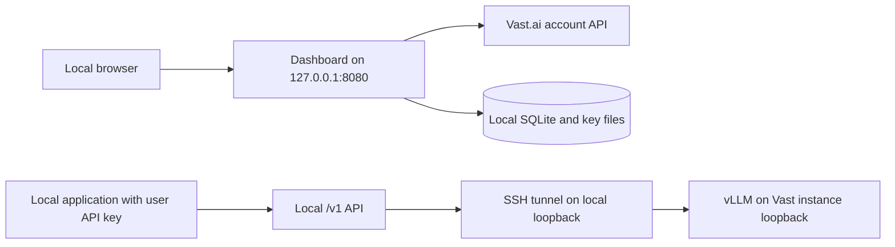

# Architecture

Vast Private LLM keeps its dashboard and OpenAI-compatible API on the owner's computer. It rents one Vast.ai GPU instance and uses an SSH tunnel to reach vLLM. There is no public vLLM HTTP port on the Vast instance.

## Components

| Path | Responsibility |
| --- | --- |
| `app/main.py` | FastAPI setup, local browser session, and loopback-only admin routes |
| `app/routes/` | Dashboard, user-key, deployment, settings, and `/v1` routes |
| `app/deploy.py` | One-instance lifecycle, startup progress, reconciliation, and recovery |
| `app/vast.py` | Vast SDK adapter for offers, account credit, and instance actions |
| `app/tunnel.py` | SSH connection and instance host-key tracking |
| `app/inference.py` | Local request forwarding and streaming to vLLM |
| `app/db.py`, `app/keys.py` | SQLite state and hashed user API keys |

## Trust boundaries

- **Admin dashboard:** the HTTP server should listen only on `127.0.0.1`. The dashboard creates a local browser session automatically and uses CSRF tokens for changes. It has no remote admin login flow. Use SSH port forwarding for remote browser access; do not publish this dashboard through an internet-facing reverse proxy.
- **User API:** `/v1/models` and `/v1/chat/completions` require a Bearer key created in the dashboard. A user key is shown once, stored as a hash, and can be revoked. The Vast API key is separate and must never be sent to `/v1`.
- **GPU instance:** vLLM listens at `127.0.0.1:8000` inside the instance. The SSH tunnel binds a random local loopback port and forwards only to that internal port. The app checks `/v1/models` before marking a deployment ready.
- **Disk:** `VASTLLM_DATA_DIR` defaults to `./data`; it holds `app.db`, the saved Vast key, the app-managed SSH pair, and `known_hosts`. The dashboard saves a Vast key and SSH private key with owner-only permissions. Keep the directory private and use one dashboard process per data directory.

The deployment service records an operation ID before asking Vast to create an instance and labels the instance with that ID. After an uncertain create result or process restart, it checks the account for that label rather than blindly renting another machine. See [deployment and recovery](deployment.md).
